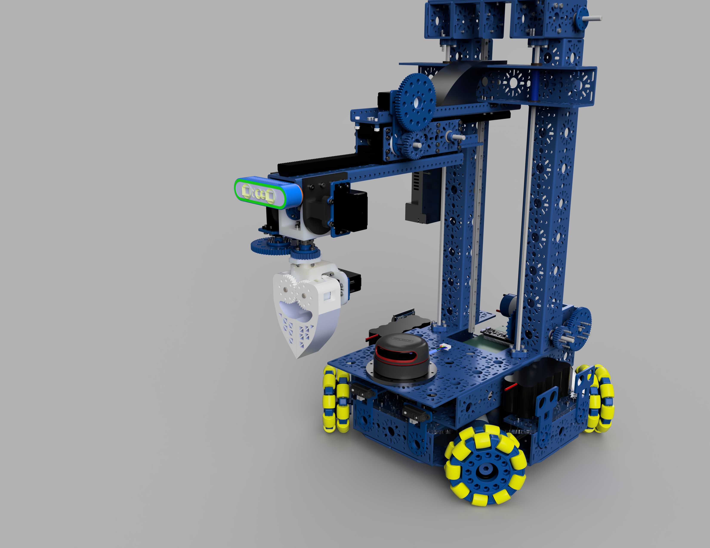
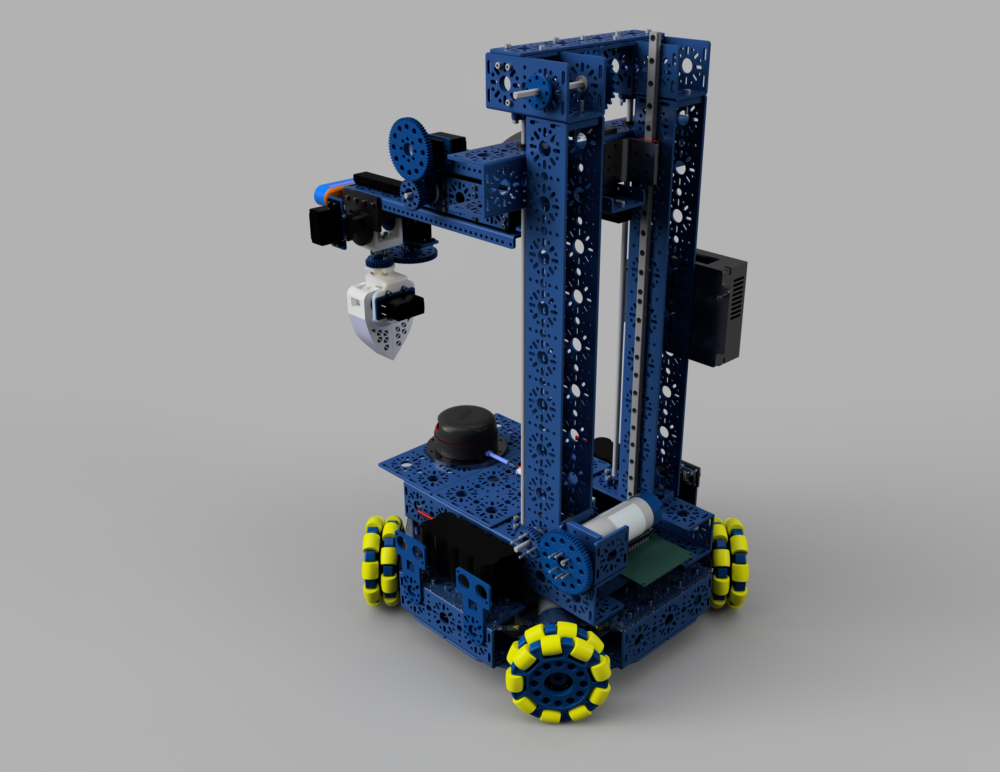
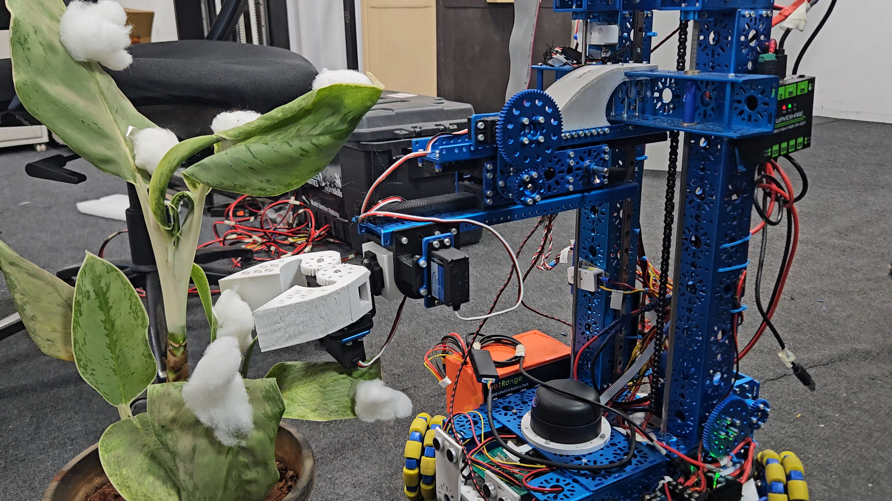

# Agrobot

Agrobot is a ROS 2-based cotton plucking robot built with Studica Robotics hardware, dual ESP32 micro-ROS firmware, onboard vision, and an omni-directional X-drive base.

The system detects cotton bolls using a depth-camera RGB stream, aligns and approaches the target, actuates a lift + claw mechanism to pluck, and returns the cotton to the storage base.

## System Architecture

### Mission Flow (Architecture First)

1. `agrobot_vision` runs YOLO-based detection and publishes target geometry (`yolo_results`).
2. `agrobot_vision/object_tracking.py` converts target error into `cmd_vel` tracking motion and completion status.
3. `agrobot_controller` converts robot velocity commands into wheel angular velocity targets and closes the wheel speed loop.
4. `agrobot_firmware` (ESP32 base controller) applies motor PWM commands and publishes encoder feedback via micro-ROS.
5. `agrobot_hardware` and `agrobot_firmware_s3` control lift/servo/end-effector hardware and report switch/sensor feedback.
6. `agrobot_demos/cotton_plucking.py` orchestrates the autonomous pluck sequence using tracking completion and timed manipulator actions.

### Runtime Dataflow (Core Topics)

| Stage | Input | Output |
|---|---|---|
| Vision detection | `gemini_e/color/image_raw` | `yolo_results`, `annotated_compressed_image` |
| Target tracking | `yolo_results`, `start_object_tracking` | `cmd_vel`, `object_tracking_completed` |
| Velocity mux | `cmd_vel` (navigation/tracking), `cmd_vel/joy` | `cmd_vel/drive` |
| Kinematics + odom | `cmd_vel/drive`, `wheel_angular_vel/feedback` | `wheel_angular_vel/control`, `odom` |
| Wheel speed control | `wheel_angular_vel/control`, `encoder_pulses` | `motor_pwm`, `wheel_angular_vel/feedback` |
| Base microcontroller | `motor_pwm`, `lift_motor_pwm` | `encoder_pulses`, `encoder_lift_motor` |
| Manipulator control | `servo_angle/*`, `lift_direction`, `limit_switch_states` | `servo_angles`, `lift_motor_pwm` |
| Sensor microcontroller | `servo_angles` | `sensor_data`, `limit_switch_states` |

## Repository Map

| Path | Purpose |
|---|---|
| `agrobot_bringup/` | System-level launch composition for base, actuators, vision tracking, TF, and micro-ROS agents. |
| `agrobot_controller/` | X-drive inverse/forward kinematics, odometry publishing, and wheel-speed PID control. |
| `agrobot_demos/` | High-level mission orchestration (autonomous cotton plucking state machine). |
| `agrobot_hardware/` | Hardware-facing ROS 2 nodes for servo aggregation, lift motor gating, IMU, and lidar launch. |
| `agrobot_interfaces/` | Custom ROS 2 message/service/action definitions shared by ROS and micro-ROS firmware. |
| `agrobot_localization/` | Cartographer SLAM and EKF localization launch/configuration. |
| `agrobot_navigation/` | Nav2 stack launch and parameterization for omni-drive navigation. |
| `agrobot_teleop/` | Joystick teleoperation mapping, teleop_twist_joy integration, and twist mux config. |
| `agrobot_vision/` | YOLO detection/tracking pipeline, model assets, and vision utilities. |
| `agrobot_firmware/` | PlatformIO + micro-ROS firmware for base drive motors and encoders (ESP32). |
| `agrobot_firmware_s3/` | PlatformIO + micro-ROS firmware for manipulator/sensors (ESP32-S3). |

## Package Documentation

- [agrobot_bringup](agrobot_bringup/README.md)
- [agrobot_controller](agrobot_controller/README.md)
- [agrobot_demos](agrobot_demos/README.md)
- [agrobot_hardware](agrobot_hardware/README.md)
- [agrobot_interfaces](agrobot_interfaces/README.md)
- [agrobot_localization](agrobot_localization/README.md)
- [agrobot_navigation](agrobot_navigation/README.md)
- [agrobot_teleop](agrobot_teleop/README.md)
- [agrobot_vision](agrobot_vision/README.md)
- [agrobot_firmware](agrobot_firmware/README.md)
- [agrobot_firmware_s3](agrobot_firmware_s3/README.md)

## Electrical Design

- Exported image: 

- Perf Board:  


## CAD Model





[Open Interactive 3D CAD Model (Fusion 360)](https://a360.co/4j9ysVT)

## Robot Photos and Demo Videos

### Photos



### Demo Videos

- [Demo Video 1](docs/media/demo_1.mp4)
- [Demo Video 2](docs/media/demo_2.mp4)
- [Demo Video 3](docs/media/demo_3.mp4)

## Dependencies and Prerequisites

| Layer | Required Components |
|---|---|
| OS + ROS 2 | Ubuntu 22.04 + ROS 2 Humble |
| Core ROS stacks | `nav2_*`, `robot_localization`, `cartographer_ros`, `tf2_ros` |
| Input and command tools | `joy_linux`, `teleop_twist_joy`, `twist_mux` |
| Sensors and perception | `orbbec_camera`, `rplidar_ros`, `laser_filters`, `cv_bridge`, OpenCV |
| ML runtime | `ultralytics`, NumPy, (optional TensorRT engine artifacts in `agrobot_vision/model`) |
| Control/PID | `simple_pid` |
| micro-ROS bridge | `micro_ros_agent` (serial mode used in bringup) |
| Firmware toolchain | PlatformIO (ESP32 + ESP32-S3), `micro_ros_platformio` |
| IMU userspace libs | `adafruit-circuitpython-bno08x` and board I2C stack (for `imu_driver.py`) |

## Build and Setup

```bash
# From workspace root (one level above src)
cd <your_ros2_workspace>
colcon build --symlink-install
source install/setup.bash
```

## Canonical Bringup Workflows

### 1) Start micro-ROS agents for both MCUs

```bash
source install/setup.bash
ros2 launch agrobot_bringup uros_agents_launch.py
```

### 2) Start base + teleop + actuator stack

```bash
source install/setup.bash
ros2 launch agrobot_bringup robot_bringup_launch.py
```

### 3) Start vision detection and camera

```bash
source install/setup.bash
ros2 launch agrobot_bringup vision_tracking_launch.py
```

### 4) Run autonomous cotton plucking demo

```bash
source install/setup.bash
ros2 run agrobot_demos cotton_plucking.py
```

### 5) Optional localization stack

```bash
source install/setup.bash
ros2 launch agrobot_localization ekf_launch.py
ros2 launch agrobot_localization cartographer_launch.py
```

### 6) Optional navigation stack

```bash
source install/setup.bash
ros2 launch agrobot_navigation nav2_bringup.launch.py \
  map:=/absolute/path/to/map.yaml \
  params_file:=$(ros2 pkg prefix agrobot_navigation)/share/agrobot_navigation/config/params.yaml
```

## Quick Operational Notes

### Servo angle conventions used by the plucking workflow

- **Servo 1 (Claw rotation):** back `115`, ground `180`, front `260`
- **Servo 2 (Grip):** closed `145`, open `180`
- **Servo 3 (Arm extension):** retracted `180-225`, extended `300`

### ROS Domain

Both firmware projects set micro-ROS domain ID to `20`. Use the same domain ID in host runtime if your environment is configured explicitly.

